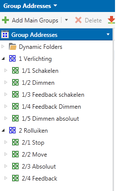
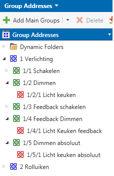
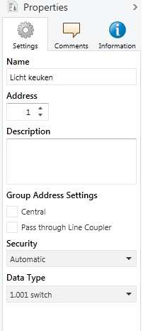
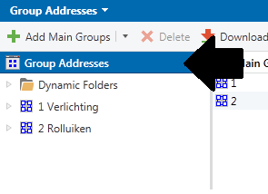
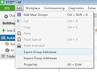
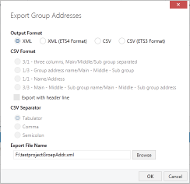
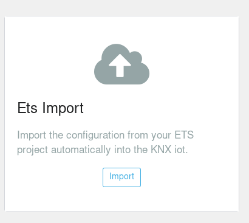
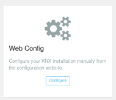

# Aanmaken van een configuratie file

Het aanmaken van een configuratiefile kan gebeuren op 2 verschillende manieren:

- [Via de ETS import tool](#via-de-ets-import-tool)
- [Via de web configuratie tool](#via-de-web-configuratie-tool)
- [Manueel via config file](#manueel-via-config-file)

## Via de ETS import tool

De ETS import webtool is een webservice die op basis van een export van een werkend ETS project een config.json file aanmaakt dat gebruikt kan worden om uw KNX-IoT installatie te besturen via een webservice. 

Inhoud:

1. [Aanmaken van ETS project](#aanmaken-van-ets-project)
2. [Exporteren van de groep adressen](#exporteren-van-de-groep-adressen)
3. [Openen van de ETS import tool](#openen-van-de-ETS-import-tool)


### Aanmaken van ETS project

Voor het aanmaken van een KNX ETS project wordt er verwezen naar 1 van de KNX gecertificeerde cursusen. We gaan er hier vanuit dat u weet hoe een correct project aangemaakt en in gebruik genomen wordt. Er zijn wel een paar opmerkingen/tips om het importeren zo makkelijk mogelijk te laten verlopen:


- Gebruik een juist gestructureerde groep adressen structuur: 


- Geef groep adressen niet exact dezelfde naam, doe het bijvoorbeeld zoals volgt:


- Geef elk groep adres het juiste type als dit niet automatisch gebeurd:

- Toegelaten types zijn:
	- 1.001
	- 3.007
	- 5.001


### Exporteren van de groep adressen

Als het hele ETS project klaar is en voldoet aan bovenstaande tips, kan het geëxporteerd worden.

- Open het "Group Addresses" paneel in ETS en selecteer de hoogste groep:


- Selecteer in de menubalk Edit -> Export "Group Addresses":


- Zorg dat het formaat op XML staat en kies een locatie om op te slaan:



### Openen van de ETS import tool

De ETS import tool kan geopend worden via de landing page op de locale webserver:

- Zoek het ip-address van uw KNX-IoT bord
- Surf naar:
```
<ip-addr>:80
```

- Klik op import:


- Volg alle instructies en de configuratie is voltooid.


## Via de web configuratie tool

De web configuratie tool kan gebruikt worden om zelf nieuwe objecten aan te maken in de config.json file, maar ook om wijzigingen aan te brengen of objecten te verwijderen.

- Zoek het ip-address van uw KNX-IoT bord
- Surf naar:
```
<ip-addr>:80
```

- Klik op configure:



## Manueel via config file

Deze methode is enkel aan te raden als je exact weet hoe JSON files werken en het systeem ze zal interpreteren. Een verkeerde aanpassing kan lijden tot een onbruikbare config.json file. Als dit het geval is dient er opnieuw 1 aangemaakt te worden via de ets-import.


- De config file kan geopend worden met een simpele texteditor: 

```
nano /ets/KNX-iot/config.json
```
- De structuur voor een nieuwe node ziet er uit als volgt:

```
{
    "Naam": "Licht keuken",			-> Naam voor user identificatie
    "Type": 1,						-> Type op de bus (kijk hieronder voor alle types)
    "SendAddr": "1\/1\/1",			-> Het groep adres in de KNX installatie
    "homekit": true,				-> Zichtbaarheid in homekit
    "homekitNaam": "Licht keuken",	-> De naam dat homekit zal gebruiken
    "uname": "lichtkeuken_1_111",	-> Unieke naam voor elk object (kijk hieronder voor de opbouw!!)
    "Soort": "Lamp",				-> Soort accessoire voor homekit (Lamp, Dimmer of Rolluik)
    "SchakelObject": "0",			-> Uname van schakelobject bij dimmer 
    "FeedbackObject": "0"			-> Uname van feedback bij dimmer en rolluik
},
```

- De mogelijke types zijn:
	- 1: Bool
	- 2: Relatieve dimmer
	- 3: Absoluute dimmer
	- 4: Scene
	- 5: Absoluut rolluik

- Een uname wordt volgens volgende methode opgebouwd:

```
Naam in lowercase zonder spaties
+
het type
+
het groeps adres zonder /

Alles aaneen gezet met _

vb: lichtkeuken_1_111
```